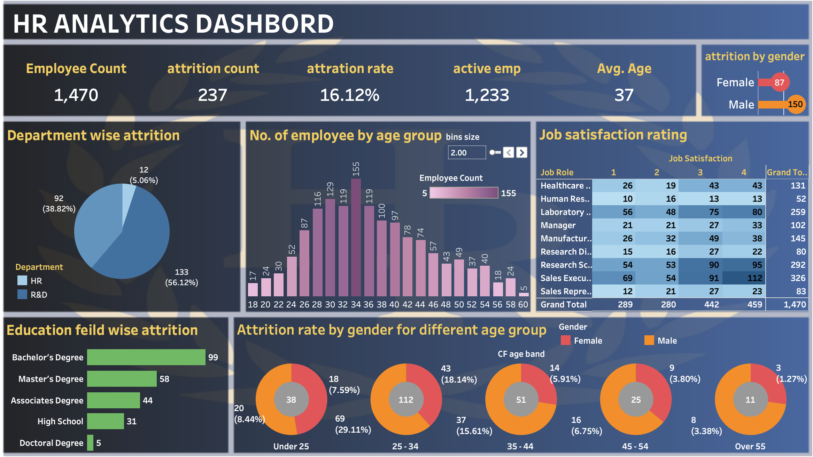

#  HR Analytics Dashboard (Tableau)

##  Project Overview
This project presents an **HR Analytics Dashboard** built using **Tableau** to analyze employee data and uncover insights related to attrition, demographics, and job satisfaction.

The dashboard helps HR teams and management to:
- Monitor employee attrition trends
- Understand workforce distribution
- Identify key factors affecting employee turnover

---

##  Objectives
- Analyze employee attrition rate
- Understand department-wise attrition
- Study employee distribution by age group
- Evaluate job satisfaction levels
- Compare attrition across gender and education fields

---

##  Dataset Information
The dataset used in this project contains HR-related data such as:
- Employee ID
- Age
- Gender
- Department
- Job Role
- Education Field
- Attrition Status
- Job Satisfaction

 File included: [`HR Data.xlsx`](https://github.com/pagaleatharva/HR-ANALYTICS-DASHBORD/blob/main/HR%20Data.xlsx)

---

##  Dashboard Features

###  KPI Metrics
- Total Employees: **1,470**
- Attrition Count: **237**
- Attrition Rate: **16.12%**
- Active Employees: **1,233**
- Average Age: **37**

---

###  Visualizations Included
-  Department-wise Attrition (Pie Chart)
-  Employee Distribution by Age Group (Histogram)
-  Job Satisfaction Rating (Table)
-  Education Field-wise Attrition (Bar Chart)
-  Attrition by Gender (Bar Chart)
-  Attrition by Gender across Age Groups (Donut Charts)

---

##  Tools & Technologies Used
- Tableau Desktop Public Edition
- Microsoft Excel
- Data Visualization Techniques

---

##  How to Use
1. Download the `.twbx` or `.twb` file
2. Open in Tableau Desktop / Tableau Public
3. Connect dataset (`HR Data.xlsx`) if required
4. Explore the dashboard interactively

---

##  Dashboard Preview


---

##  Project Structure
```
HR-Analytics-Dashboard/
│
├── HR Data.xlsx
├── HR-Dashboard.png
├── README.md

```

---

##  Key Insights
- Higher attrition observed in certain departments (e.g., R&D)
- Employees aged 25–34 show higher attrition
- Job satisfaction varies significantly across roles
- Education field impacts employee retention

---

##  Future Improvements
- Add machine learning model for attrition prediction
- Connect real-time HR data
- Deploy on Tableau Public or Tableau Server
- Add filters for better interactivity

---

##  Author
**Atharva Pagale**
- GitHub:(https://github.com/pagaleatharva)
- LinkedIn: [https:linkedin.com/in/atharva-pagale-224786296](https://www.linkedin.com/in/atharva-pagale-224786296?lipi=urn%3Ali%3Apage%3Ad_flagship3_profile_view_base_contact_details%3BNFxCTVUzR9G7AL%2Ffo4RR0w%3D%3D)

---


